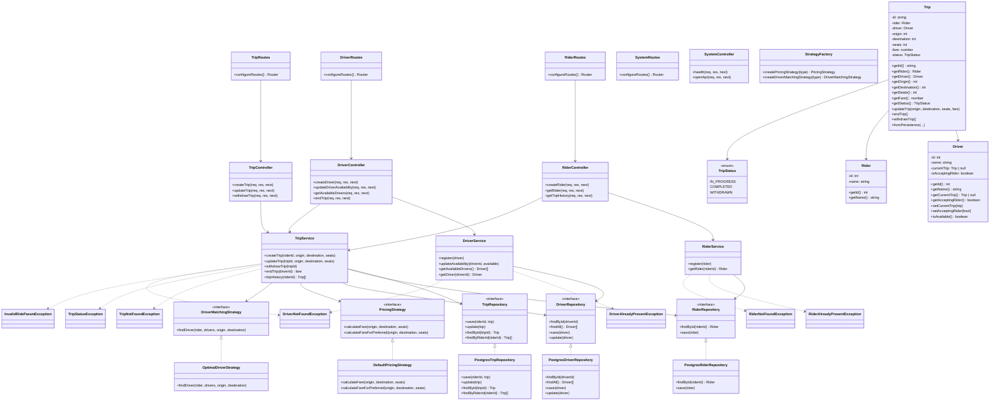

# Class Diagram - Ride Sharing System

```mermaid
classDiagram
    %% ROUTES
    class DriverRoutes {
        +configureRoutes() Router
    }
    class RiderRoutes {
        +configureRoutes() Router
    }
    class TripRoutes {
        +configureRoutes() Router
    }
    class SystemRoutes {
        +configureRoutes() Router
    }

    %% CONTROLLERS
    class DriverController {
        +createDriver(req, res, next)
        +updateDriverAvailability(req, res, next)
        +getAvailableDrivers(req, res, next)
        +endTrip(req, res, next)
    }
    class RiderController {
        +createRider(req, res, next)
        +getRider(req, res, next)
        +getTripHistory(req, res, next)
    }
    class TripController {
        +createTrip(req, res, next)
        +updateTrip(req, res, next)
        +withdrawTrip(req, res, next)
    }
    class SystemController {
        +health(req, res, next)
        +openApi(req, res, next)
    }

    %% SERVICES
    class DriverService {
        +register(driver)
        +updateAvailability(driverId, available)
        +getAvailableDrivers() Driver[]
        +getDriver(driverId) Driver
    }
    class RiderService {
        +register(rider)
        +getRider(riderId) Rider
    }
    class TripService {
        +createTrip(riderId, origin, destination, seats)
        +updateTrip(tripId, origin, destination, seats)
        +withdrawTrip(tripId)
        +endTrip(driverId) fare
        +tripHistory(riderId) Trip[]
    }

    %% STRATEGY FACTORY
    class StrategyFactory {
        +createPricingStrategy(type) PricingStrategy
        +createDriverMatchingStrategy(type) DriverMatchingStrategy
    }

    %% STRATEGIES
    class PricingStrategy <<interface>> {
        +calculateFare(origin, destination, seats)
        +calculateFareForPreferred(origin, destination, seats)
    }
    class DefaultPricingStrategy {
        +calculateFare(origin, destination, seats)
        +calculateFareForPreferred(origin, destination, seats)
    }
    class DriverMatchingStrategy <<interface>> {
        +findDriver(rider, drivers, origin, destination)
    }
    class OptimalDriverStrategy {
        +findDriver(rider, drivers, origin, destination)
    }

    %% REPOSITORY INTERFACES
    class DriverRepository <<interface>> {
        +findById(driverId)
        +findAll() Driver[]
        +save(driver)
        +update(driver)
    }
    class RiderRepository <<interface>> {
        +findById(riderId) Rider
        +save(rider)
    }
    class TripRepository <<interface>> {
        +save(riderId, trip)
        +update(trip)
        +findById(tripId) Trip
        +findByRiderId(riderId) Trip[]
    }

    %% REPOSITORY IMPLEMENTATIONS
    class PostgresDriverRepository {
        +findById(driverId)
        +findAll() Driver[]
        +save(driver)
        +update(driver)
    }
    class PostgresRiderRepository {
        +findById(riderId) Rider
        +save(rider)
    }
    class PostgresTripRepository {
        +save(riderId, trip)
        +update(trip)
        +findById(tripId) Trip
        +findByRiderId(riderId) Trip[]
    }

    %% DOMAIN MODELS
    class Driver {
        -id: int
        -name: string
        -currentTrip: Trip | null
        -isAcceptingRider: boolean
        +getId() int
        +getName() string
        +getCurrentTrip() Trip | null
        +getAcceptingRider() boolean
        +setCurrentTrip(trip)
        +setAcceptingRider(bool)
        +isAvailable() boolean
    }
    class Rider {
        -id: int
        -name: string
        +getId() int
        +getName() string
    }
    class Trip {
        -id: string
        -rider: Rider
        -driver: Driver
        -origin: int
        -destination: int
        -seats: int
        -fare: number
        -status: TripStatus
        +getId() string
        +getRider() Rider
        +getDriver() Driver
        +getOrigin() int
        +getDestination() int
        +getSeats() int
        +getFare() number
        +getStatus() TripStatus
        +updateTrip(origin, destination, seats, fare)
        +endTrip()
        +withdrawTrip()
        +fromPersistence(...)
    }
    class TripStatus {
        <<enum>>
        IN_PROGRESS
        COMPLETED
        WITHDRAWN
    }

    %% EXCEPTIONS
    class DriverAlreadyPresentException
    class DriverNotFoundException
    class InvalidRideParamException
    class RiderAlreadyPresentException
    class RiderNotFoundException
    class TripNotFoundException
    class TripStatusException

    %% RELATIONSHIPS
    DriverRoutes --> DriverController
    RiderRoutes --> RiderController
    TripRoutes --> TripController

    DriverController --> DriverService
    DriverController --> TripService
    RiderController --> RiderService
    RiderController --> TripService
    TripController --> TripService

    DriverService --> DriverRepository
    RiderService --> RiderRepository
    TripService --> TripRepository
    TripService --> RiderRepository
    TripService --> DriverRepository
    TripService --> PricingStrategy
    TripService --> DriverMatchingStrategy

    DriverRepository <|.. PostgresDriverRepository
    RiderRepository <|.. PostgresRiderRepository
    TripRepository <|.. PostgresTripRepository

    PricingStrategy <|.. DefaultPricingStrategy
    DriverMatchingStrategy <|.. OptimalDriverStrategy

    Trip --> Driver
    Trip --> Rider
    Trip --> TripStatus

    DriverService ..> DriverAlreadyPresentException
    DriverService ..> DriverNotFoundException
    RiderService ..> RiderAlreadyPresentException
    RiderService ..> RiderNotFoundException
    TripService ..> TripNotFoundException
    TripService ..> TripStatusException
    TripService ..> InvalidRideParamException
    TripService ..> DriverNotFoundException
```

