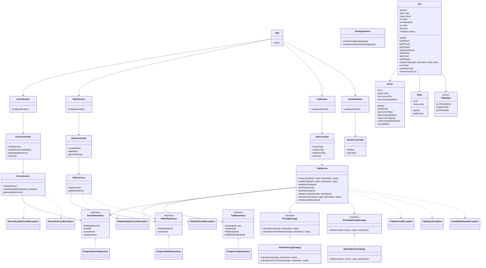

# Class Diagram

## About this diagram

This class diagram shows the full backend architecture of the ride-sharing project. It includes the route layer, controller layer, service layer, strategy/factory layer, repository layer, domain models, enums, and exception classes. It demonstrates how the application is structured using separation of concerns and interface-based dependencies.