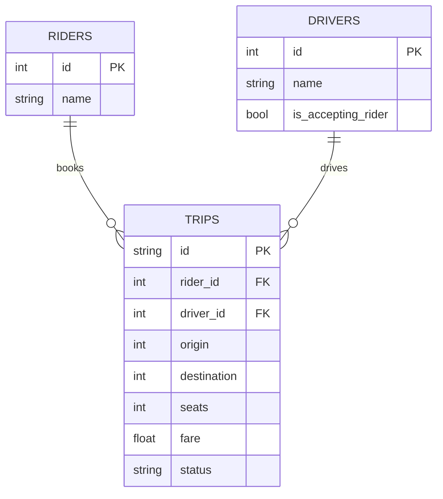

# ER Diagram

## About this diagram

This ER diagram captures the database entities and relationships used by the ride-sharing backend. Each rider may book many trips, and each driver may serve many trips. The `TRIPS` table stores foreign keys back to `RIDERS` and `DRIVERS`, plus ride details like origin, destination, seats, fare, and status.