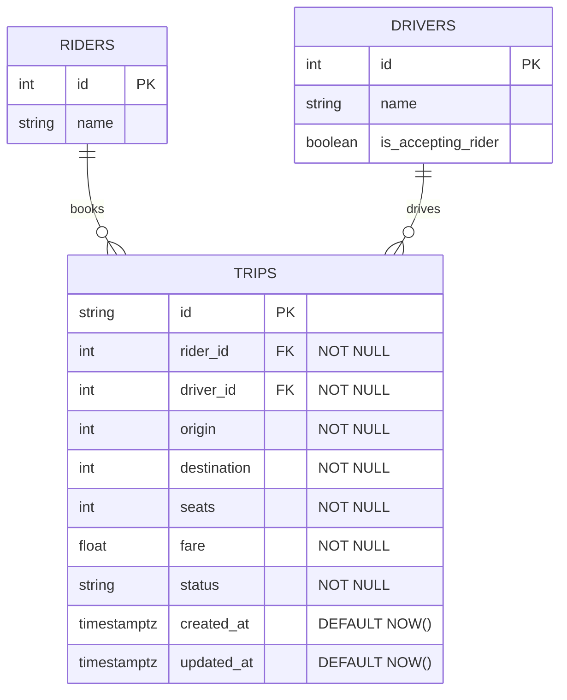

# ER Diagram - Ride Sharing System

## Relationships

| Relationship | Type | Description |
|--------------|------|-------------|
| Rider → Trip | One-to-Many | A rider can book multiple trips |
| Driver → Trip | One-to-Many | A driver can serve multiple trips |

## Database Indexes

- `idx_trips_rider_id` on `trips(rider_id)`
- `idx_trips_driver_id` on `trips(driver_id)`
- `idx_trips_status` on `trips(status)`

