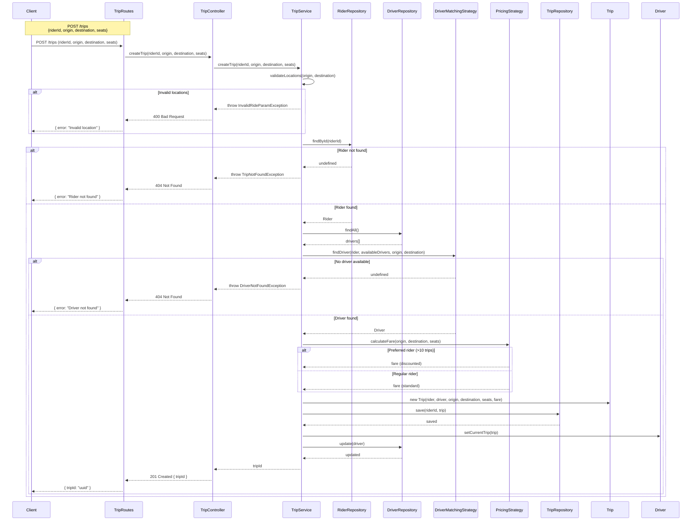
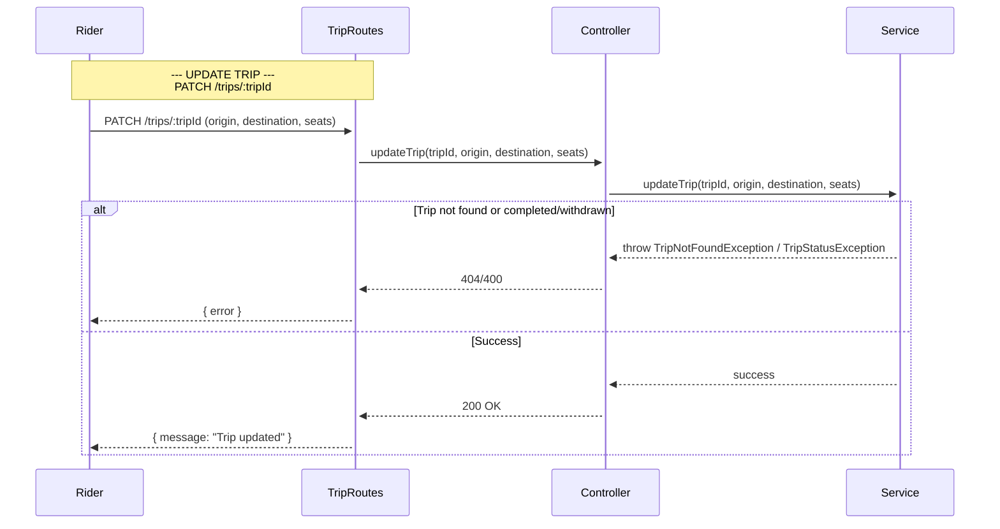
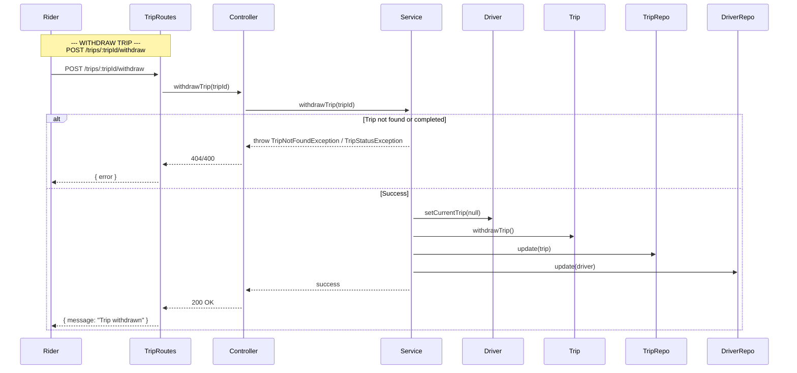
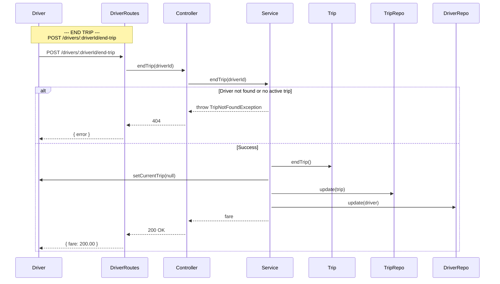

# Sequence Diagram - Create Trip Flow

```mermaid
sequenceDiagram
    participant Client
    participant Express as TripRoutes
    participant Controller as TripController
    participant Service as TripService
    participant RiderRepo as RiderRepository
    participant DriverRepo as DriverRepository
    participant Matching as DriverMatchingStrategy
    participant Pricing as PricingStrategy
    participant TripRepo as TripRepository

    Note over Client, Express: POST /trips<br/>{riderId, origin, destination, seats}

    Client->>+Express: POST /trips (riderId, origin, destination, seats)
    Express->>+Controller: createTrip(riderId, origin, destination, seats)
    Controller->>+Service: createTrip(riderId, origin, destination, seats)

    Service->>Service: validateLocations(origin, destination)
    alt Invalid locations
        Service-->>Controller: throw InvalidRideParamException
        Controller-->>Express: 400 Bad Request
        Express-->>Client: { error: "Invalid location" }
    end

    Service->>RiderRepo: findById(riderId)
    alt Rider not found
        RiderRepo-->>Service: undefined
        Service-->>Controller: throw TripNotFoundException
        Controller-->>Express: 404 Not Found
        Express-->>Client: { error: "Rider not found" }
    else Rider found
        RiderRepo-->>Service: Rider

        Service->>DriverRepo: findAll()
        DriverRepo-->>Service: drivers[]

        Service->>Matching: findDriver(rider, availableDrivers, origin, destination)
        alt No driver available
            Matching-->>Service: undefined
            Service-->>Controller: throw DriverNotFoundException
            Controller-->>Express: 404 Not Found
            Express-->>Client: { error: "Driver not found" }
        else Driver found
            Matching-->>Service: Driver

            Service->>Pricing: calculateFare(origin, destination, seats)
            alt Preferred rider (>10 trips)
                Pricing-->>Service: fare (discounted)
            else Regular rider
                Pricing-->>Service: fare (standard)
            end

            Service->>Trip: new Trip(rider, driver, origin, destination, seats, fare)
            Service->>TripRepo: save(riderId, trip)
            TripRepo-->>Service: saved

            Service->>Driver: setCurrentTrip(trip)
            Service->>DriverRepo: update(driver)
            DriverRepo-->>Service: updated

            Service-->>Controller: tripId
            Controller-->>Express: 201 Created { tripId }
            Express-->>Client: { tripId: "uuid" }
        end
    end
```

## Complete Trip Lifecycle

```mermaid
sequenceDiagram
    participant Rider
    participant System as TripRoutes
    participant Controller
    participant Service

    Note over Rider, System: --- UPDATE TRIP ---<br/>PATCH /trips/:tripId

    Rider->>+System: PATCH /trips/:tripId (origin, destination, seats)
    System->>+Controller: updateTrip(tripId, origin, destination, seats)
    Controller->>+Service: updateTrip(tripId, origin, destination, seats)
    alt Trip not found or completed/withdrawn
        Service-->>Controller: throw TripNotFoundException / TripStatusException
        Controller-->>System: 404/400
        System-->>Rider: { error }
    else Success
        Service-->>Controller: success
        Controller-->>System: 200 OK
        System-->>Rider: { message: "Trip updated" }
    end
```

```mermaid
sequenceDiagram
    participant Rider
    participant System as TripRoutes
    participant Controller
    participant Service

    Note over Rider, System: --- WITHDRAW TRIP ---<br/>POST /trips/:tripId/withdraw

    Rider->>+System: POST /trips/:tripId/withdraw
    System->>+Controller: withdrawTrip(tripId)
    Controller->>+Service: withdrawTrip(tripId)
    alt Trip not found or completed
        Service-->>Controller: throw TripNotFoundException / TripStatusException
        Controller-->>System: 404/400
        System-->>Rider: { error }
    else Success
        Service->>Driver: setCurrentTrip(null)
        Service->>Trip: withdrawTrip()
        Service->>TripRepo: update(trip)
        Service->>DriverRepo: update(driver)
        Service-->>Controller: success
        Controller-->>System: 200 OK
        System-->>Rider: { message: "Trip withdrawn" }
    end
```

```mermaid
sequenceDiagram
    participant Driver
    participant System as DriverRoutes
    participant Controller
    participant Service

    Note over Driver, System: --- END TRIP ---<br/>POST /drivers/:driverId/end-trip

    Driver->>+System: POST /drivers/:driverId/end-trip
    System->>+Controller: endTrip(driverId)
    Controller->>+Service: endTrip(driverId)
    alt Driver not found or no active trip
        Service-->>Controller: throw TripNotFoundException
        Controller-->>System: 404
        System-->>Driver: { error }
    else Success
        Service->>Trip: endTrip()
        Service->>Driver: setCurrentTrip(null)
        Service->>TripRepo: update(trip)
        Service->>DriverRepo: update(driver)
        Service-->>Controller: fare
        Controller-->>System: 200 OK
        System-->>Driver: { fare: 200.00 }
    end
```

